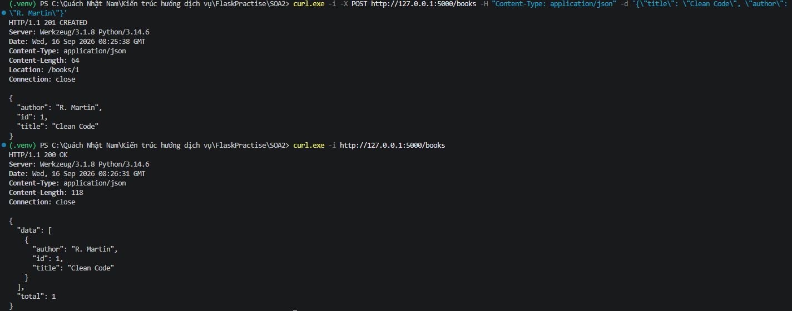

Bài 1 :

Tạo cuốn và gọi ra danh sách cuốn sách : 

Bài 2 :

Test PATCH thay thế 1 cuốn sách : .png)

Test PUT thay đổi cuốn sách : .png)

Test DELETE xóa 1 cuốn sách : .png)

Bài 3 :

Test gọi danh sách sách mặc định : .png)

Test tính năng Phân trang tùy chỉnh : .png)

Test tính năng Lọc dữ liệu theo tác giả : .png)

Test tính năng Tìm kiếm sách : .png)